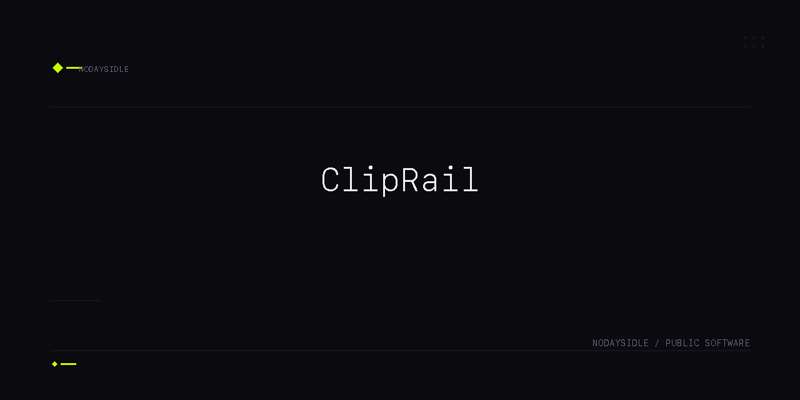

# ClipRail

> A local, text-only clipboard history for the macOS menu bar.

ClipRail keeps the plain-text snippets you actually reuse one click away. Recent clips, pinned favorites, search, delete, pause, and re-copy — with no network access, no account, and no auto-paste surprises.

**Version 1.2.0** · macOS 14+ · Swift 6 · SwiftUI

## Overview

ClipRail is a focused menu-bar utility for plain-text clipboard reuse. It is intentionally small and deliberately boring about data: plain text only, local storage only, no network.

## Features

| Area | Capability |
|------|------------|
| History | Last 10 unpinned plain-text clips, newest first |
| Pinned clips | Up to 3 pinned clips that survive Clear |
| Search | Live case-insensitive filter in the popover header |
| Delete | Remove a single pinned or unpinned row immediately |
| Pause | Stop capture temporarily; no backfill on resume |
| Dedupe | Re-copying the same text within 60 seconds bumps the row |
| Timestamps | Relative ages refresh when the popover opens |
| Re-copy | Tap a row to put it back on the pasteboard; you paste manually |
| Privacy | Local UserDefaults only; no network, sync, telemetry, or account |

## Privacy

- Plain text only
- Local storage only
- No URLSession, sockets, telemetry, analytics, or sync
- No microphone, camera, Accessibility, or global hotkey permissions
- No auto-paste — ClipRail only re-copies; you decide where to paste

If you need image history, cloud sync, universal clipboard, or automation hooks, this product is intentionally not doing that.

## Installation

### Download

Download **ClipRail-v1.2.0-macos.zip** from [Releases](https://github.com/nodaysidle/cliprail/releases).

Verify your download:

| | |
|---|---|
| Filename | `ClipRail-v1.2.0-macos.zip` |
| Size | ~164 KB |
| SHA256 | `b5c796a35795de3f247d5538292baedd5e64e595f28d6837f676c0e96d65a4d4` |

```bash
shasum -a 256 ClipRail-v1.2.0-macos.zip
```

Unzip and drag **ClipRail.app** to `/Applications`. On first launch, if macOS blocks the ad-hoc signed build, right-click the app in Finder → **Open**, or go to **System Settings → Privacy & Security** and click **Open Anyway**.

### Build from source

```bash
git clone https://github.com/nodaysidle/cliprail.git
cd cliprail
swift test
./Scripts/package_app.sh release
./Scripts/install_app.sh
```

Full operator guide: [USERGUIDE.md](USERGUIDE.md)

## Usage

1. Launch ClipRail and use the menu-bar clipboard icon.
2. Copy plain text with `⌘C` in any app.
3. Open ClipRail to search, pin, delete, pause, clear, or re-copy clips.
4. Click a row to re-copy it, then paste manually with `⌘V`.

## Development

```bash
swift test
swift build
./Scripts/package_app.sh release
./Scripts/smoke_test.sh
```

## Project Structure

| Path | Purpose |
|------|---------|
| `Sources/ClipRail/` | Swift menu-bar app source |
| `Tests/ClipRailTests/` | Store and model tests |
| `Scripts/` | Package, install, smoke, and icon scripts |
| `USERGUIDE.md` | End-user operation guide |
| `CHANGELOG.md` | Release-facing changes |

## Status

Active — v1.2.0. Ad-hoc signed, not notarized.

## Contributing

This repository is not currently accepting external contributions.

## License

Proprietary — NODAYSIDLE.
